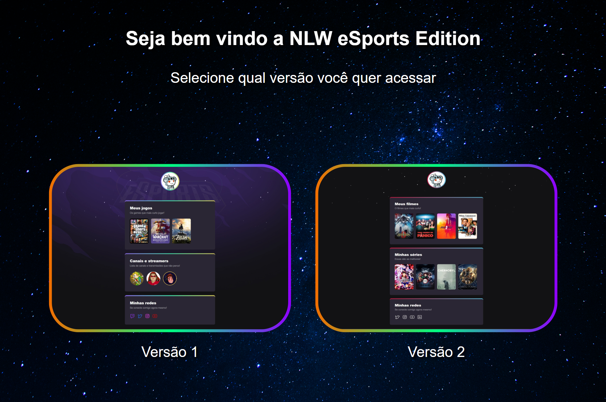
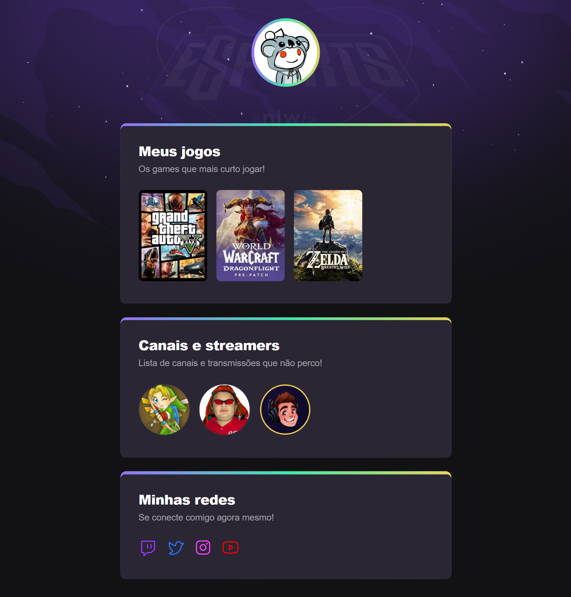

<h1 align="center"> eSports Trilha Explorer </h1>

Evento exclusivo e gratuito, promovido pela Rocketseat para ensino de tecnologias WEB.

  <a href="#-tecnologias">Tecnologias</a>&nbsp;&nbsp;&nbsp;|&nbsp;&nbsp;&nbsp;
  <a href="#-projeto">Projeto</a>&nbsp;&nbsp;&nbsp;|&nbsp;&nbsp;&nbsp;
  <a href="#-layout">Layout</a>&nbsp;&nbsp;&nbsp;|&nbsp;&nbsp;&nbsp;
  <a href="#memo-licença">Licença</a>

  

### Link da página: [Clique aqui](https://nlw-esports-trilha-explorer-ten.vercel.app).

 

   Pagina inicial

  
   Versão 1 (original)

  
   Versão 2 (variação)

<h3 align="center">Video Demonstração</h3>

## 🚀 Tecnologias

Esse projeto foi desenvolvido com as seguintes tecnologias:

- HTML
- CSS
- Git e Github

## 💻 Projeto

Simulação de uma plataforma web e móvel na qual os jogadores podem encontrar parceiros para os jogos mais populares. Como desafio extra, foi desenvolvido outras 2 páginas, uma para escolher qual versão entrar e a outra com um site alternativo com temática de filmes e séries.

## 🔖 Layout

Você pode visualizar o layout original do projeto através [DESSE LINK](https://www.figma.com/file/08rM7lRV7LSLtjBSNA5rao/NLW-eSports---Explorer-%26-Ignite?node-id=6%3A23).

## 📝 Licença

Esse projeto está sob a licença MIT.

---

Feito com ❤️ por Bruno Benicio 👋 em parceria com a Rocketseat 💜
